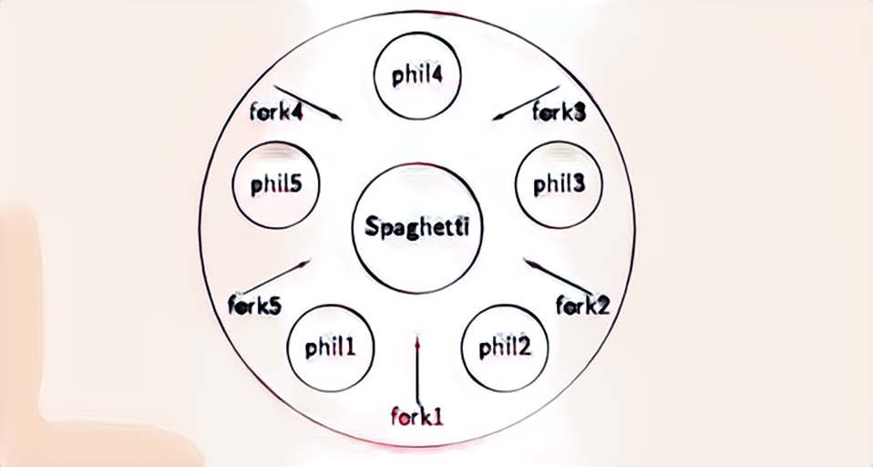

# Philosophers

Philosophers is a School 42 project.

### My score
[](https://github.com/JaeSeoKim/badge42)

## Setup and usage

```
git clone https://github.com/mharriso/Philosophers.git
cd Philosophers/philo
make
./philo 5 800 200 200
```

### Program take the following arguments

* number_of_philosophers

* time_to_die (in milliseconds)

* time_to_eat (in milliseconds)

* time_to_sleep (in milliseconds)

* number_of_times_each_philosopher_must_eat (optional argument): If all
philosophers have eaten at least this times, the simulation stops. If not specified, the simulation stops when a
philosopher dies.

### About dining philosophers problem


The diagram above represents the problem. There are five silent philosophers (P1 – P5) sitting around a circular table, spending their lives eating and thinking.

There are five forks for them to share (1 – 5) and to be able to eat, a philosopher needs to have forks in both his hands. After eating, he puts both of them down and then they can be picked by another philosopher who repeats the same cycle.
### Goal
The goal is to come up with a scheme that helps the philosophers achieve their goal of eating and thinking without getting starved to death.
